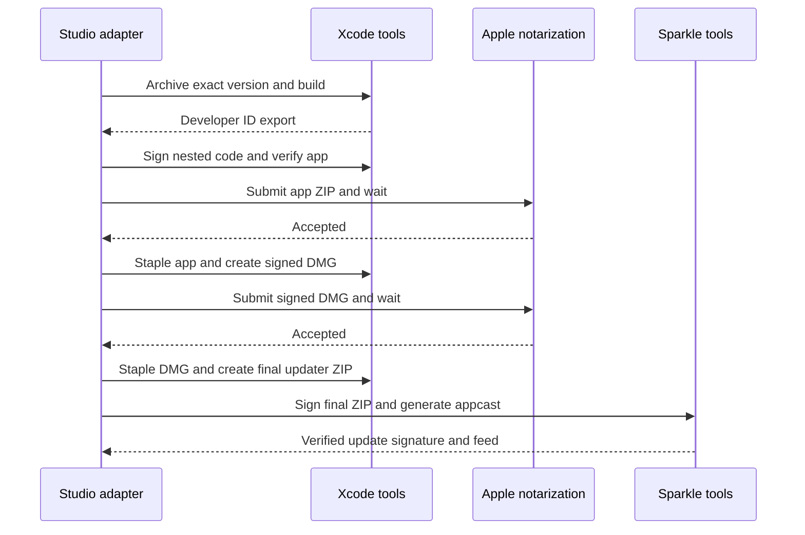

# macOS candidate preparation

Studio engineers must declare product facts and supply signing credentials before
preparing a candidate. Reviewers must keep local adapter tests separate from a
signed installation, an updater transition, and Apple approval.

The direct adapter uses the candidate's exact semantic version and positive
integer build number. It archives with Xcode at two jobs, exports with Developer
ID, signs nested Mach-O code before its containing bundles, enables hardened
runtime, and verifies the final signature. Every nested app, XPC service and app
extension needs an explicit entitlement declaration. It rejects debugging
entitlements and checks the signed app against the declared entitlements.

Apple receives a ZIP containing the signed app. The adapter never submits a raw
`.app`. After Apple accepts that ZIP, the adapter staples and validates the app.
It creates a DMG, signs it, obtains separate notarization acceptance, and staples
and validates the DMG. It then creates the final updater ZIP from the stapled app.
Sparkle's official `sign_update` signs and verifies those final ZIP bytes.
`generate_appcast` emits the feed. The adapter checks the feed's version, build,
URL, size and signature against the ZIP and rejects any mutation of the ZIP.

The following sequence diagram shows the direct candidate preparation sequence.



## Declaration

Product facts belong at the macOS component root. The adapter also accepts the
same facts in a component's `macos` mapping for earlier declarations. The root
form wins when both forms declare a value. `nested_binaries` maps paths relative
to the exported app to entitlement plist paths relative to the product repository.
The direct app's `Info.plist` must contain the declared `SUFeedURL` and
`SUPublicEDKey`. Xcode receives matching `INFOPLIST_KEY_*` build settings, and the
adapter verifies the exported values even when a project uses its own plist.

```yaml
components:
  - id: app
    kind: macos
    path: .
    project: App.xcodeproj
    scheme: App
    app_name: App
    bundle_id: dev.williecubed.app
    min_system_version: '14.0'
    architectures: [arm64, x86_64]
    entitlements:
      direct: App/Direct.entitlements
      store: App/Store.entitlements
    nested_binaries:
      Contents/Library/LoginItems/AppHelper.app: App/Helper.entitlements
    store_configuration: AppStore
    store_provisioning_profiles:
      dev.williecubed.app: Studio App Store profile
    checks: []
release:
  channels: [direct, app-store]
  macos:
    team_id: TEAMID
    developer_id: 'Developer ID Application: Studio (TEAMID)'
    notary_profile: studio-notary
    sparkle:
      feed_url: https://downloads.example.com/app/appcast.xml
      download_url: https://downloads.example.com/app/releases/42-1/
      public_key: DECLARE_THE_REAL_BASE64_PUBLIC_KEY
      tools_path: /trusted/sparkle-2.10.0/bin
    store:
      app_id: '123456789'
      application_identity: 'Apple Distribution: Studio (TEAMID)'
      installer_identity: '3rd Party Mac Developer Installer: Studio (TEAMID)'
```

`SPARKLE_PRIVATE_KEY` supplies Sparkle's base64 private-key export. The adapter
rejects missing feeds, missing keys, malformed keys and public/private mismatch.
The private key never enters a command argument. Temporary key files have mode
0600 and disappear when their operation ends. Native output stays captured
because Sparkle can print malformed private-key input in its error text.

The runner needs the Developer ID identity and private key in its keychain.
Credential bootstrap owns certificate import and cleanup. Notarization uses
`notary_profile` when declared. Otherwise the adapter requires
`APPLE_API_PRIVATE_KEY`, `APPLE_API_KEY_ID` and `APPLE_API_ISSUER` from the runner.
It writes the API key to a temporary protected file for `notarytool`.

Apps with registered App Groups declare `direct_provisioning_profiles` by bundle
ID. Each entry names a profile `specifier` and its native `build_setting`, such
as `STUDIO_APP_PROFILE`. The target's Release configuration sets
`PROVISIONING_PROFILE_SPECIFIER` to `$(STUDIO_APP_PROFILE)`. Each target retains
its own entitlement file. The shared adapter never overrides all targets with
the main app's entitlements.

`APPLE_PROVISIONING_PROFILES_BASE64` binds one JSON list of base64-encoded Apple
profiles. Credential preparation verifies each profile's team, bundle ID and
declared name before installing it. Cleanup removes only profiles installed by
that run. Direct and Store profiles remain distinct even for the same bundle ID.
PKCS#12 imports must pass a real `security import` check before provisioning.
Mac-compatible OpenSSL exports use `-keypbe PBE-SHA1-3DES`,
`-certpbe PBE-SHA1-3DES` and `-macalg sha1` for that encrypted interchange file.

The lifecycle renders `download_url` to the immutable candidate directory before
calling the adapter. Promotion publishes the returned ZIP and DMG before the
mutable appcast. It verifies the candidate manifest and artifact digests and
never rebuilds during promotion.

## App Store separation

Curfew remains direct-only. Other products must explicitly declare the
`app-store` channel, an AppStore Xcode configuration, sandbox entitlements,
provisioning profiles and Store signing identities. The Store adapter creates a
separate archive and export. It rejects embedded Sparkle and Sparkle feed keys.
It checks sandbox entitlements on the exported app and each nested executable
bundle, verifies signatures and creates a signed PKG with `productbuild`.

`store.upload` validates that immutable PKG with `altool` before uploading it.
On resume, it queries the exact app, semantic version and build number. A VALID
or PROCESSING build already in Apple avoids a second upload. Each native upload
uses a protected API key file through `API_PRIVATE_KEYS_DIR`.

The App Store Connect client generates ES256 JWTs with native OpenSSL and the
fixed `appstoreconnect-v1` audience. Tokens expire after 600 seconds. The client
uses Apple's current `reviewSubmissions` and `reviewSubmissionItems` endpoints.
It sets `releaseType` to `MANUAL`. It preserves processing and review states as
`apple-pending`. A rejection becomes `failed` and never triggers a resubmission.
Existing review drafts with unrelated items block submission.

Reconciliation only accepts the candidate's exact Apple build. It requests a
manual release only when the parent supplies a fresh authorization callback.
The callback must recheck revocation and whether a newer candidate superseded
this candidate. Without that callback, PENDING_DEVELOPER_RELEASE stays pending.
After the callback passes, the adapter rereads the immutable candidate and the
selected Apple build before requesting release. It records `completed` only
when Apple reports READY_FOR_SALE or READY_FOR_DISTRIBUTION for that exact build.

## Python integration

The adapters return final artifact `Path` values. Injected runners receive an
argument array and an explicit working directory and return captured text. The
production runner raises on nonzero exit and never invokes a shell.

```python
macos.preflight(config, component, channel='direct')
macos.prepare(config, component, output, version, build_number, 'direct')
store.preflight(config, component)
store.prepare(config, component, output, version, build_number, 'app-store')
store.upload(config, candidate, component, authorized_digest=candidate.digest)
store.submit(config, candidate, component, authorized_digest=candidate.digest)
store.reconcile(config, candidate, component,
                authorized_digest=candidate.digest,
                authorize=validate_current_release_authorization)
```

The parent validates review evidence before passing `authorized_digest` and
persists each upload, review submission and reconciliation operation in the
candidate's promotion journal. No adapter treats possession of Apple credentials
as product release approval.

## Swift integration

The package pins Sparkle 2.10.0. App Store targets depend on `Distribution`, which
has no Sparkle dependency. Direct targets depend on `DirectDistribution`.
`Distribution.BuildInformation` reads the exact embedded version, build and
bundle identifier. `DistributionChannel` declares direct, appStore or development.
`UpdateConfiguration` rejects a non-HTTPS feed and a malformed public key.

A direct app keeps one updater alive and starts it after initializing its app.
The initializer reads `SUFeedURL` and `SUPublicEDKey` from the host bundle.
An explicit `UpdateConfiguration` must match the bundle's declared values.

```swift
import DirectDistribution

@MainActor
func makeUpdater() throws -> DirectUpdater {
    let updater = try DirectUpdater(bundle: .main)
    try updater.start()
    return updater
}
```

`DistributionCommands(updater:)` adds the Check for Updates command to a SwiftUI
app's `.commands`. Its enabled state observes Sparkle's `canCheckForUpdates`.
An app can call `checkForUpdates()` from its own menu instead. The app decides
how a development build handles missing keys. Release candidate preparation
always rejects missing keys.

## Verification limits

Python tests use native-boundary fixtures to check ordering, immutable bytes,
missing keys, entitlements, archive identity and Apple lifecycle states. One
Store test generates a real P-256 key and verifies the generated JWT through
OpenSSL. Swift tests compile the SDK against the official Sparkle binary and
check bundle and update configuration behavior. These tests do not prove a
signed installation or an updater transition on an installed product.

The implementation still needs credentialed Developer ID signing and Apple
notarization runs for each product. It also needs installed-app update evidence
and App Store approval for products that declare Store distribution. A local
machine without the signing identity must report that missing prerequisite.
It must not issue a candidate with an unsigned substitute.
