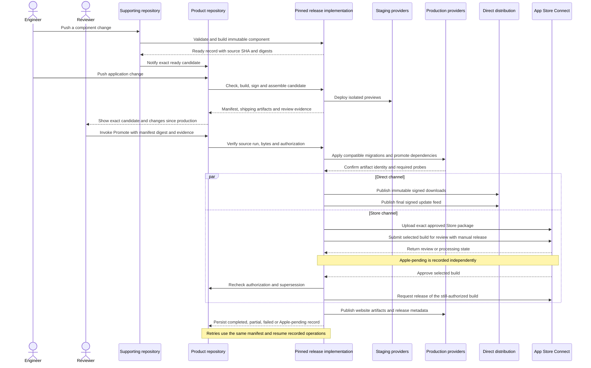

# Product candidate and promotion sequence

Studio reviewers must inspect an immutable candidate and submit digest-bound
acceptance evidence before invoking Promote. Product owners must maintain this
sequence whenever they change release ordering.

The product's Mac repository owns the assembled release. Supporting repositories
publish ready records after successful default-branch checks. The shared
implementation captures those exact artifacts during assembly. A notification
starts assembly and never authorizes production.

The following sequence diagram shows candidate creation, human authorization,
dependency promotion, and the separate direct and Store channels.

The shared workflows run in the calling repository. GitHub's
[reusable workflow contract](https://docs.github.com/en/actions/how-tos/reuse-automations/reuse-workflows)
provides that ownership boundary. Every product pins the implementation by
commit SHA, and its launcher also checks the release archive's SHA-256.

A manual invocation records the reviewer who authorized the manifest. It does
not create an independent required-reviewer gate on the organization's current
private-repository plan. The direct release and Apple's review cannot form one
atomic transaction. A later push creates another candidate. A later approved
candidate supersedes an older authorization before any mutable publication.

The implementation rejects missing credentials, failed product checks, missing
updater configuration, changed artifacts, incompatible dependency contracts and
unbound review evidence. Reviewers must record clean installation, supported
hardware launch, data-preserving upgrades and connected acceptance against the
shipping artifact. Staging screenshots supply additional evidence.
